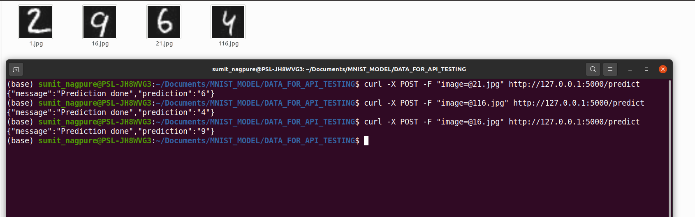

# MNIST Prediction Project

## Description

This project involves predicting digits from the MNIST dataset using a machine learning model. The project is structured into several directories:

1. **training**:  Contains the training files to train the model.
2. **model**: This directory should contain the trained model. Download the model from the provided Google Drive link
[MNIST_TRAINED_MODEL](https://drive.google.com/file/d/1FFKqvndhcDiEpzQQ3Jo7hDLg1JnoMONy/view?usp=sharing)
and place it here.
3. **inference**: Contains the Dockerfile to build a Docker image that serves the inference script as a REST endpoint.
4. **k8**: Contains Kubernetes deployment files for deploying the project in a Kubernetes cluster.
5. **DATA_FOR_API_TESTING**: Contains sample images for testing the API.

## Prerequisites

    Python installed
    Docker installed
    Kubernetes installed
    Minikube installed

## Steps to Run the Project
### 1. Download and Place the Model
Download the trained model from the provided Google Drive link and place it in the model directory.

### 2. Set Permissions and Run Deployment Script
Navigate to the home directory and give execute permissions to the deploy.sh script, then run the script:

    sudo chmod -R +777 deploy.sh
    ./deploy.sh

This script will:

    Navigate to the inference directory.
    Build the Docker image from the Dockerfile.
    Start a Docker container to serve the inference script as a REST API endpoint on port 4000.

### 3. Test the REST API Endpoint

After running the deploy.sh script, you can test the API using the sample images in the DATA_FOR_API_TESTING directory. For example:

    curl -X POST -F "image=@DATA_FOR_API_TESTING/21.jpg" http://127.0.0.1:4000/predict
You can replace 21.jpg with the name of another image file in the directory.

You can find screenshot of post request below

### 4. Deploy to Kubernetes

If you want to deploy the project in a Kubernetes cluster, navigate to the k8 directory and run the following commands:

    kubectl apply -f k8/deployment.yaml
    kubectl apply -f k8/service.yaml
This will create the necessary deployments and services in Kubernetes.

## Notes

1. Ensure that your Minikube cluster is running before applying the Kubernetes configurations.
2. The REST API endpoint will be exposed on the port specified in the Kubernetes service file.

## Troubleshooting

1. If the Docker container does not start, check the logs for errors:
    docker logs <container_id>
2. If the API is not responding, ensure that the container is running and the correct ports are mapped.

## Conclusion

This project demonstrates a complete workflow for training, deploying, and serving a machine learning model for digit prediction using Docker and Kubernetes. Follow the steps carefully to set up and run the project successfully.

